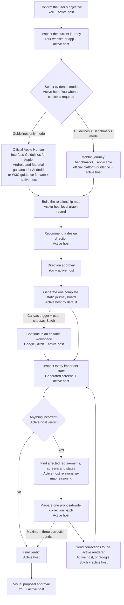

# Using Design Arc

[Home](../README.md) · [Getting started](getting-started.md) · [Using Design Arc](using-design-arc.md) · [Codex](codex.md) · [Claude Code](claude-code.md) · [FAQ](faq.md) · [Advanced controls](advanced-controls.md) · [Evidence and methodology](evidence-and-methodology.md) · [Upgrades and migration](upgrades-and-migration.md) · [Trust and sources](trust-limitations-and-sources.md)

How do I use Design Arc after installation?

## Start a review in ordinary language

Describe the product outcome you want in ordinary language. For example: “Use Design Arc to help me make our onboarding less confusing.” Explicitly asking the active host to use Design Arc invokes it directly, as does choosing a journey starter inside a confirmed Codex project home.

Commands are optional shortcuts, not required knowledge. The Claude adapter does not create a Codex task or project home.

If the active host selects Design Arc for a suitable request that did not invoke it directly, it asks for permission before beginning. Until you approve, it does not start setup, inspect your product, gather Design Arc evidence, or create Design Arc project or review records. Automatic skill selection is not guaranteed, so ask for Design Arc by name or use a confirmed Codex project home when you want certainty. Design Arc does not run continuously or silently in every task.

Examples of requests for which Codex or Claude Code may offer Design Arc include:

- “Help me make our onboarding less confusing.”
- “Audit how customers complete checkout and propose a better complete journey.”
- “Redesign account recovery so people can get back in without weakening security.”

Natural-language requests such as “use Guidelines only for this run” or “follow your recommendation this time” are one-run overrides; they do not rewrite the saved project preference.

The workflow, evidence rules, approval modes, renderer choice, and design-only handoff boundary are shared. Invocation, saved preferences, active-review records, return paths, and adapter upgrades are platform-specific. Codex and Claude Code never merge, migrate, resume, or continue an active review across runtimes.

## Graph-assisted corrections

Design Arc understands how requirements, evidence and screens affect one another, helping it make more precise corrections without surrendering approval control.

The active host is Codex for the Codex adapter and Claude Code for the Claude adapter.

Graph assistance is active by default for every new 0.3.0 review in both existing and new projects when no project or host-local safety control turns it off. That default does not rewrite project preferences or host-local settings. An active review remains exactly as it started; its next clean review gains the 0.3.0 assistance.

Graph assistance adds no approval gate. Objective Confirmation, the Direction Gate, the Visual Proposal Gate, the active approval mode, and the full review of every important state remain exactly the same.

The loop controls what happens and when Design Arc stops. The relationship map helps Design Arc understand what each correction affects; it advises the loop but never replaces it.

Official Apple guidance governs Apple platform requirements; the applicable first-party guidance does the same for Android or web. Mobbin supplies product precedent only in Guidelines + Benchmarks mode.

Visualization adapts to the active host:

- **Codex** creates static screen images and complete journey boards directly by default. Stitch remains optional, and is recommended when canvas editing, multiple visual alternatives, or sustained refinement materially helps.
- **Claude Code** does not claim native image generation. It can prepare HTML/CSS, SVG, specifications, and lightweight static journey boards, and recommends Stitch early for polished mockups, visual exploration, editable layouts, or continued refinement. It does not send users to Codex unless they request a cross-platform handoff.

Before Stitch is used, the active host prepares the complete evidence-grounded journey, requirements, and important-state inventory. Stitch visualizes rather than establishes correctness; Codex or Claude Code validates the returned screens and applies the same proposal-wide correction loop of up to three rounds. Stitch remains optional and separately authorized.

Claude's decision prompt is: “Claude can prepare a lightweight static journey board here. For polished, editable screen mockups, I recommend a Stitch-ready visual proposal. Which would you prefer?”

Design Arc bundles no MCP server, so the generic diagram does not invent a connection that is not configured. Mobbin and Google Stitch are external services, not automatically available to the active host. Google now provides an official Stitch MCP server and SDK, but Design Arc uses that route only when it is separately installed, configured, and authorized. When a particular review actually uses an MCP, its run record and evidence labels name the exact configured MCP server or tool; otherwise they name the browser or manual access path used. Design Arc does not imply an official Mobbin MCP integration.

Graph assistance is optional internal reasoning support. If it is unavailable or turned off, Design Arc continues the same review without it. It never replaces evidence, platform guidance, approvals, or complete screen inspection. People who want to inspect or manage it can use the commands in [Advanced controls](advanced-controls.md).

## Return to a project

| When | Codex | Claude Code |
| --- | --- | --- |
| First day | Ask to use Design Arc, confirm the guided choices, and approve or decline the proposed project home. | Ask to use Design Arc, confirm the guided choices, and separately approve or decline the optional project reminder. |
| Next day | Open the pinned `Design Arc — <Project Name>` task and describe the journey. | Open the product project in a new clean Claude Code session and ask to use Design Arc. |
| New product | Open the new saved project and ask to use Design Arc; its optional home remains separate. | Open the new product project and ask to use Design Arc; its preferences remain separate. |

### Codex project homes

Codex setup can add one approved, pinned home named `Design Arc — <Project Name>` to each participating project. Each home is a launchpad, not a workspace for the design review. Every journey starter opens a clean local task in that same saved project, while the pinned home stays available for the next request.

There is no global Design Arc home. A project with no confirmed Codex setup receives no home and no sidebar item. Design Arc reuses an existing home for the same title and project instead of creating a duplicate. If it finds extra same-project homes, it reports them for you to clean up; it never deletes them.

If Codex cannot create or pin the task, Design Arc saves confirmed preferences, says clearly that no home is ready, and gives you the exact title, starter card, and manual create-and-pin steps. You can later ask Design Arc to recover or repin the current project’s home.

### Claude Code re-entry reminder

Claude Code creates no project home. Reopen the product project in a clean session and ask to use Design Arc. A new session does not continue a Codex review, and an already-open session keeps the runtime and workflow version with which it started.

The optional project reminder is proposed separately during Claude setup and is written only after approval for that exact edit. Setup preserves existing project instructions, never adds a duplicate reminder, and changes nothing when permission is declined. The reminder helps Claude offer the skill; it does not start Design Arc automatically.

## Choosing the active host or Stitch for the screens

Design Arc generates one complete static journey board in the active host by default: Codex for the Codex adapter and Claude Code for the Claude adapter. It does not build disposable application logic merely to visualize the proposal. The board covers every important state, while separate high-resolution screens are generated only when closer inspection or a focused correction needs them.

Stitch is optional and Design Arc recommends it when any one genuine canvas trigger occurs. Triggers include a second meaningful visual direction, changes across three or more screens, precise visual iteration, self-editing, another-day continuation, a board becoming difficult to review, unrelated drift after one active-host correction round, device variants, collaboration, or design export.

The first recommendation explains the specific benefit. Design Arc may recommend Stitch again, briefly, only after another genuine trigger or materially larger scope. A Stitch recommendation is advisory and never transfers the proposal automatically. You can stay in the active host. That choice applies to the current editing phase; Design Arc may ask again if the work materially grows. If you say not to recommend Stitch again for this review, Design Arc suppresses every further recommendation for that review.

When you choose Stitch, Design Arc preserves the approved requirements and compares the latest retrieved or supplied Stitch changes before accepting them as the current proposal. Stitch access—including an exact Stitch MCP when actually configured—remains separately authorized. Design Arc itself bundles no MCP.

## What happens after screens render

Design Arc corrects straightforward visual drift before asking you to approve the visual proposal. The initial proposal may be followed by at most three correction rounds for the whole proposal. Each round batches every known repairable mismatch, generates a new proposal, and reinspects the complete result. The same validation and correction rules apply whether the active host or Stitch renders the screens.

If the proposal still does not match, Design Arc stops and flags every unresolved mismatch and the attempts already made. It asks sooner only when the correction would change the approved direction, requires new authorization, or cannot be proven in a prototype.

## Approval and trust controls

> Design Arc does not silently redesign, implement, or deploy your product. You choose the objective, evidence approach, and approval behavior.

Objective Confirmation establishes the product outcome before the audit or evidence gathering begins. The Direction Gate confirms the recommended design direction; the Visual Proposal Gate confirms the validated visual proposal. Existing 0.3.x review records may call this the Stitch Gate; it is the same gate, not an additional approval.

| Approval mode | Objective | Visual Proposal Gate |
| --- | --- | --- |
| **Guided** — recommended for a new project | Confirm; stop at Direction Gate | Stop for approval |
| **Follow recommendation** | Confirm; continue at Direction Gate with the visibly marked recommendation | Stop for approval |
| **Fully automatic** | The current request must state an explicit objective; continue at Direction Gate with the visibly marked recommendation | Continue only after a `meets direction` verdict |

“Follow your recommendation” is a one-run Follow recommendation alias. “Bypass both gates” is a one-run Fully automatic alias, but it never permits Design Arc to invent a missing objective. Automatic modes change decision pauses, not the audit, evidence, complete-state, validation, or ownership requirements.

Next: [Evidence and methodology](evidence-and-methodology.md).
