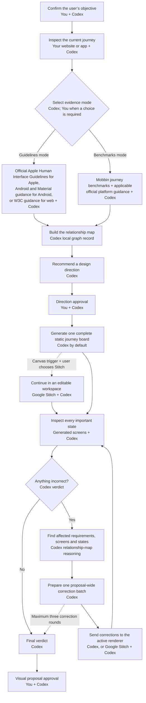

# Using Design Arc

[Home](../README.md) · [Getting started](getting-started.md) · [Using Design Arc](using-design-arc.md) · [Evidence and methodology](evidence-and-methodology.md) · [Upgrades and migration](upgrades-and-migration.md) · [Trust and sources](trust-limitations-and-sources.md)

How do I use Design Arc after installation?

## Start a review in ordinary language

For guaranteed activation, start with `$design-arc`. Explicitly asking Codex to “use Design Arc” also invokes it directly, as does choosing a journey starter inside a confirmed Design Arc project home.

In Claude Code, use `/design-arc:design-arc` for a review and add `setup`, `mode`, or `graph` when you want that focused action. Explicitly asking Claude Code to use Design Arc also invokes it directly. The Claude adapter does not create a Codex task or project home.

If Codex selects Design Arc for a request that could benefit from it but you have not invoked it directly, it asks for your permission before beginning. Until you approve, it does not start Design Arc setup, inspect your product, gather Design Arc evidence, or create Design Arc project or review records. Automatic skill selection is not guaranteed, so use `$design-arc`, ask for Design Arc by name, or use the confirmed project home when you want to be certain it is active. Design Arc does not run continuously or silently in every task.

Examples of requests for which Codex may offer Design Arc include:

- “Help me make our onboarding less confusing.”
- “Audit how customers complete checkout and propose a better complete journey.”
- “Redesign account recovery so people can get back in without weakening security.”

For setup, recovery, or one-run preferences, use:

```text
$design-arc setup
$design-arc home
$design-arc evidence benchmarks
$design-arc evidence guidelines
$design-arc mode
$design-arc mode guided
$design-arc mode follow-recommendation
$design-arc mode fully-automatic
```

Natural-language requests such as “use Guidelines for this run” or “follow your recommendation this time” are one-run overrides; they do not rewrite the saved project preference.

The workflow, evidence rules, approval modes, renderer choice, and design-only handoff boundary are shared. Invocation, saved preferences, active-review records, return paths, and adapter upgrades are platform-specific. Codex and Claude Code never merge, migrate, resume, or continue an active review across runtimes.

## More precise corrections in 0.3.0

Design Arc understands how requirements, evidence and screens affect one another, helping it make more precise corrections without surrendering approval control.

Graph assistance is active by default for every new 0.3.0 review in both existing and new projects when no project or laptop safety control turns it off. That default does not rewrite a project preference, home, or laptop setting. An active review remains exactly as it started; its next clean review gains the 0.3.0 assistance.

Graph assistance adds no approval gate. Objective Confirmation, the Direction Gate, the Visual Proposal Gate, the active approval mode, and the full review of every important state remain exactly the same.

The loop controls what happens and when Design Arc stops. The relationship map helps Design Arc understand what each correction affects; it advises the loop but never replaces it.



Official Apple guidance governs Apple platform requirements; the applicable first-party guidance does the same for Android or web. Mobbin supplies product precedent only in Benchmarks mode. Codex generates the static journey board by default. Google Stitch is an optional editable visualization workspace; neither renderer proves that a proposal is correct.

Design Arc bundles no MCP server, so the generic diagram does not invent a connection that is not configured. Mobbin and Google Stitch are external services, not automatically available to Codex. Google now provides an official Stitch MCP server and SDK, but Design Arc uses that route only when it is separately installed, configured, and authorized. When a particular review actually uses an MCP, its run record and evidence labels name the exact configured MCP server or tool; otherwise they name the browser or manual access path used. Design Arc does not imply an official Mobbin MCP integration.

Use these controls when you want to inspect or change the assistance:

```text
$design-arc graph
$design-arc graph on
$design-arc graph off
$design-arc graph explain
$design-arc graph rebuild
$design-arc graph clear
$design-arc graph global off
$design-arc graph global on
```

`graph` reports the current review without changing anything. `graph on` and `graph off` save a setting for this project only. `graph global off` is a laptop safety ceiling; `graph global on` removes that ceiling but never overrides a project that is off. A one-review request can turn assistance off for that review, but cannot override a project or laptop safety control.

At the start of a review, Design Arc reports whether assistance is active and why. Graph status has its own provenance; it is separate from evidence-mode and approval-mode provenance. `graph explain` also shows the resolution chain, review identity, workflow version, record location, and the latest validation or fallback result.

If the record is missing, invalid, or cannot be trusted, Design Arc reports the reason and continues the unchanged standard workflow without graph assistance. This is a reduction in assistance, not a blocked review or a reason to bypass the usual evidence and approval controls.

Rebuild reconstructs only the current review from current authoritative workflow facts; it does not redo research, change an approved direction, or create requirements. Clear is destructive: it requires explicit confirmation for the exact current-review graph path and deletes only that record. Clearing leaves project and laptop settings, homes, product files, and other reviews alone.

## Coming back tomorrow

Setup can add one approved, pinned home named `Design Arc — <Project Name>` to each project where you choose to use Design Arc.

That pinned-home model is Codex-specific. In Claude Code, reopen the product project in a clean session and invoke `/design-arc:design-arc`; Claude reads only the project’s `.claude/design-arc.yaml` and Claude-local review state. A new session does not continue a Codex review, and an already-open session keeps the runtime and workflow version with which it started.

The optional `CLAUDE.md` reminder is proposed separately during Claude setup and is written only after approval for that exact edit. Its complete marked block is:

```markdown
<!-- design-arc:reminder:start -->
When a UI journey request matches Design Arc, suggest `/design-arc:design-arc` and wait for explicit approval unless the user invoked Design Arc directly. Never claim Design Arc ran unless the skill loaded.
<!-- design-arc:reminder:end -->
```

Setup preserves every byte outside that block, never adds a duplicate, and leaves `CLAUDE.md` unchanged when permission is declined or safe insertion is unavailable. The reminder helps Claude offer the skill; it does not start Design Arc automatically and does not replace the slash command.

| When | What you do |
| --- | --- |
| First day | Open the project, run `$design-arc setup`, choose the two project preferences, and approve or decline its proposed home. |
| Next day | Open that project’s pinned `Design Arc — <Project Name>` task and describe the journey in ordinary language. |
| New product | Open the new saved project and run setup there once. Its preferences and optional home stay separate from every other product. |

Each home is a launchpad, not a workspace for the design review. Every journey starter opens a clean local task in that same saved project, while the pinned home stays available for the next request.

There is no global Design Arc home. A project with no confirmed Design Arc setup receives no home and no sidebar item. Design Arc reuses an existing home for the same title and project instead of creating a duplicate. If it finds extra same-project homes, it reports them for you to clean up; it never deletes them.

If Codex cannot create or pin the task, Design Arc saves confirmed preferences, says clearly that no home is ready, and gives you the exact title, starter card, and manual create-and-pin steps. Run `$design-arc home` later to report, create, recover, or repin the current project’s home.

## Choosing Codex or Stitch for the screens

Design Arc generates one complete static journey board in Codex by default. It does not build disposable application logic merely to visualize the proposal. The board covers every important state, while separate high-resolution screens are generated only when closer inspection or a focused correction needs them.

Stitch is optional and Design Arc recommends it when any one genuine canvas trigger occurs. Triggers include a second meaningful visual direction, changes across three or more screens, precise visual iteration, self-editing, another-day continuation, a board becoming difficult to review, unrelated drift after one Codex correction round, device variants, collaboration, or design export.

The first recommendation explains the specific benefit. Design Arc may recommend Stitch again, briefly, only after another genuine trigger or materially larger scope. A Stitch recommendation is advisory and never transfers the proposal automatically. You can stay in Codex. That choice applies to the current editing phase; Design Arc may ask again if the work materially grows. If you say not to recommend Stitch again for this review, Design Arc suppresses every further recommendation for that review.

When you choose Stitch, Design Arc preserves the approved requirements and compares the latest retrieved or supplied Stitch changes before accepting them as the current proposal. Stitch access—including an exact Stitch MCP when actually configured—remains separately authorized. Design Arc itself bundles no MCP.

## What happens after screens render

Design Arc corrects straightforward visual drift before asking you to approve the visual proposal. The initial proposal may be followed by at most three correction rounds for the whole proposal. Each round batches every known repairable mismatch, generates a new proposal, and reinspects the complete result. The same validation and correction rules apply whether Codex or Stitch renders the screens.

If the proposal still does not match, Design Arc stops and flags every unresolved mismatch and the attempts already made. It asks sooner only when the correction would change the approved direction, requires new authorization, or cannot be proven in a prototype.

## Approval and trust controls

> Design Arc does not silently redesign, implement, or deploy your product. You choose the objective, evidence approach, and approval behavior.

Objective Confirmation establishes the product outcome before the audit or evidence gathering begins. The Direction Gate confirms the recommended design direction; the Visual Proposal Gate confirms the validated visual proposal. Existing 0.3.x review records may call this the Stitch Gate; it is the same gate, not an additional approval.

| Approval mode | Objective | Visual Proposal Gate |
| --- | --- | --- |
| **Guided** — recommended for a new project | Confirm; stop at Direction Gate | Stop for approval |
| **Follow recommendation** | Confirm; continue at Direction Gate with the visibly marked recommendation | Stop for approval |
| **Fully automatic** | The current request must state an explicit objective; continue at Direction Gate with the visibly marked recommendation | Continue only after a `meets direction` verdict |

“Follow your recommendation” is a one-run Follow recommendation alias. “Bypass both gates” is a one-run Fully automatic alias, but it never permits Design Arc to invent a missing objective. Automatic modes change decision pauses, not the audit, evidence, complete-state, validation, or ownership requirements.

Next: [Evidence and methodology](evidence-and-methodology.md).
